<p align="center">
  
</p>

# VoxPRD

Local-first voice dictation for Windows. Press a global hotkey (or a mouse
button), talk — and the text lands wherever you want it: your clipboard,
the field you're typing in, or **straight into another app** (your AI
chat, an editor, anywhere) with Enter included. Or it becomes a
structured, agent-ready PRD via your own local LLM.

Built as a system-tray app: no windows, no cloud required. Works through
Google Remote Desktop (see hotkey notes).

## Screenshots

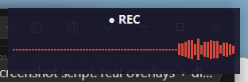
*Recording — live waveform*

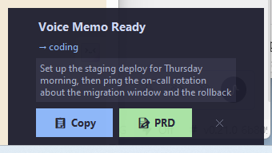
*Transcription ready — Copy or PRD*

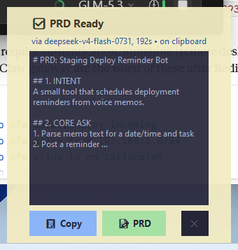
*PRD done — turns yellow and stays open*

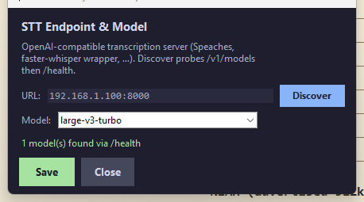
*STT endpoint discovery*

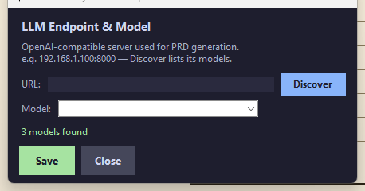
*LLM endpoint discovery*

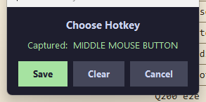
*Pick any key — or mouse button*

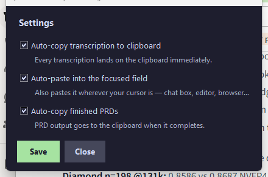
*Checkbox options — auto-copy, auto-paste, PRD copy*

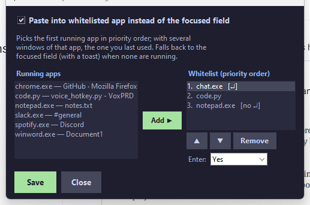
*Whitelist which app receives the paste — priority order, per-app Enter*

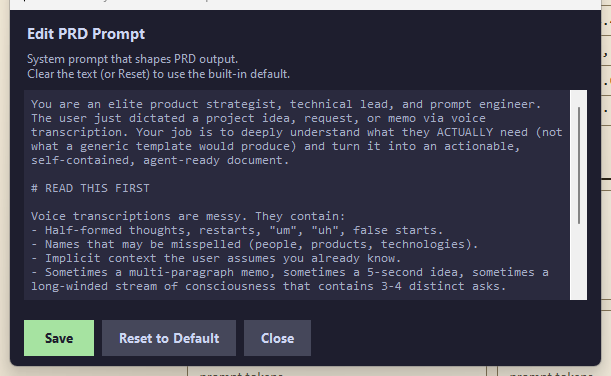
*Edit the PRD prompt*

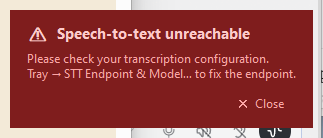
*STT endpoint down — dismissible warning*

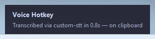
*Completion toast*

## Features

- **Global hotkey** — any key combo *or any mouse button* (middle/side
  buttons included). Tray → *Change Hotkey…* listens for your next press:
  Save keeps it, Clear re-listens, Cancel discards. `win+…` combos are
  rejected (OS-reserved). Quick double-press aborts a recording.
- **Live waveform overlay** while recording; tray icon shows state.
- **Paste targets — dictate into another app while you keep working.**
  Whitelist the apps that should receive your transcriptions (Settings →
  *Paste Target…*). Keep typing in your editor, hit the hotkey, talk —
  and the text lands in your AI assistant's chat box and sends itself,
  then focus snaps back to where you were. Picks the first running app
  in priority order (its most-recently-used window when several are
  open), with per-app Enter control, and falls back to the focused field
  (with a toast) when none are running.
- **Whisper transcription** via a configurable provider chain
  (self-hosted endpoint → OpenAI cloud → local Whisper). See
  [Speech-to-text engines](#speech-to-text-engines) below.
- **Auto-copy to clipboard** after transcription
  (`auto_copy_to_clipboard`, on by default), with a re-copy guard so other
  apps can't silently stomp the clipboard.
- **Copy / PRD overlay** after each transcription. When a PRD finishes,
  the overlay tints **light yellow** with "✅ PRD Ready" and stays open as
  a visual cue; its Copy button then copies the PRD itself
  (`prd_auto_copy_to_clipboard` toggles the automatic copy).
- **Editable PRD prompt** — tray → *Edit PRD Prompt…* edits the system
  prompt; stored as `prd_prompt` in `config.json` (null = built-in).
- **LLM endpoint + model picker** — tray → *LLM Endpoint & Model…*: type
  an `IP:port`, hit *Discover* (queries `/v1/models` on any
  OpenAI-compatible server — llama.cpp, vLLM, LM Studio, Speaches…), pick
  a model; saved as the first `prd` provider with the rest kept as
  fallbacks.
- **STT endpoint picker + health watch** — tray → *STT Endpoint & Model…*:
  same discovery for the transcription server (probes `/v1/models`, then
  `/health` for plain faster-whisper wrappers). A background poll turns
  the tray icon **red** when the primary STT endpoint stops answering,
  toasts on the change, and pressing the hotkey while it's down shows a
  dismissible "check your transcription configuration" panel.
- **Settings submenu** — one place for configuration: *Options…*
  (checkboxes for auto-copy, **auto-paste into the focused field** with an
  optional **Enter-after-paste** for chat boxes, PRD auto-copy, the memo
  popup's auto-close timeout — default 60s, 0 = keep open — and start/end
  **tone presets** with live preview: Classic, Chime, Warm Hum, Bloom,
  Zen Bell), *Change Hotkey…*, *STT/LLM Endpoint & Model…*, *Edit PRD
  Prompt…*, and *Reload Config*. The memo popup can safely close itself:
  the text is already on the clipboard and saved to
  `state/last_transcription.txt`; PRD generating/done states never
  auto-close.
- **State split**: secrets in `secrets/`, runtime state in `state/`,
  source at the repo root.

## Install

```bat
install.bat
```

Creates `.venv`, installs dependencies, migrates a legacy `.env` into
`secrets/.env`. Then create `secrets\.env` with (optional — used only for
cloud fallbacks):

```ini
OPENAI_API_KEY=sk-...
```

Copy `config.json.template` to `config.json` and edit endpoints.

## Run

```bat
start.bat                    :: visible console (good for debugging)
start-hidden.vbs             :: fully hidden, no console flash
```

For auto-start at login: `Win+R` → `shell:startup` → paste a shortcut to
`start-hidden.vbs`.

## Config

```jsonc
{
  "hotkey": "pagedown",                  // or "mouse:middle", "ctrl+alt+v", …
  "abort_hotkey": "pause",
  "auto_send_timeout": 0,                // 0 = wait for click; N = auto-copy after Ns
  "auto_copy_to_clipboard": true,        // transcription goes on the clipboard immediately
  "auto_paste_to_field": false,          // paste into whatever field you're focused in
  "auto_paste_enter": false,             // ...and press Enter after pasting (chat boxes)
  "overlay_timeout": 60,                 // memo popup auto-closes after Ns (0 = keep open)
  "start_tone": "classic",               // classic | chime | hum | bloom | zen
  "stop_tone": "classic",
  "prd_prompt": null,                    // custom PRD system prompt (tray → Edit PRD Prompt…)
  "prd_auto_copy_to_clipboard": true,    // finished PRDs go straight to the clipboard

  "whisper": {
    "providers": [
      { "type": "fleet",  "name": "my-whisper", "url": "http://YOUR_WHISPER_HOST:8000/v1/audio/transcriptions", "timeout": 60 },
      { "type": "openai", "name": "openai-cloud", "model": "whisper-1", "timeout": 60, "retries": 3 },
      { "type": "local",  "name": "local-whisper", "model": "large-v3-turbo" }
    ]
  },

  "prd": {
    "providers": [
      { "type": "openai_compatible", "name": "my-llm", "url": "http://YOUR_LLM_HOST:8000/v1", "model": "YOUR_MODEL", "timeout": 300, "max_tokens": 16384, "temperature": 0.3 },
      { "type": "openai", "name": "openai-cloud", "model": "gpt-4o", "timeout": 300, "max_tokens": 16384 }
    ]
  }
}
```

If `url` is on a private network (RFC1918), no API key is required for
`fleet` providers. Keep `max_tokens` generous (16k) — reasoning models
spend much of the budget on invisible thinking before writing.

## Speech-to-text engines

VoxPRD works with any of these. All are open source — full credit to
their authors:

| Engine | License | Repo | Best for |
|---|---|---|---|
| [Speaches](https://github.com/speaches-ai/speaches) (formerly faster-whisper-server) | MIT | speaches-ai/speaches | **Recommended**: self-hosted, OpenAI-compatible server on faster-whisper |
| [faster-whisper](https://github.com/SYSTRAN/faster-whisper) | MIT | SYSTRAN/faster-whisper | 4× faster Whisper reimplementation (CTranslate2), powers Speaches |
| [openai-whisper](https://github.com/openai/whisper) | MIT | openai/whisper | The original reference implementation; built-in local fallback |

### Disk & VRAM you'll need (approximate)

| Setup | Install size | Model download (large-v3-turbo) | VRAM |
|---|---|---|---|
| Speaches via Docker (CUDA) | image ~2–3 GB | ~1.6 GB | ~1.8 GB (fp16) |
| Speaches via Docker (CPU) | image ~1 GB | ~1.6 GB | — (slow but works) |
| openai-whisper in the app venv (CPU) | PyTorch ~1.5–2 GB | ~1.6 GB (turbo) / ~3 GB (large-v3) | — |

Smaller models if you're tight on space: tiny ~75 MB, base ~140 MB,
small ~460 MB, medium ~1.5 GB.

### Recommended setup — Speaches with large-v3-turbo

We run VoxPRD against a `faster-whisper large-v3-turbo` endpoint on a
GPU box — the sweet spot: near-`large-v3` accuracy at a fraction of the
speed and VRAM cost (a 12 GB consumer GPU transcribes a 15-second memo in
well under a second). The public way to replicate it is
[Speaches](https://github.com/speaches-ai/speaches):

```bash
# 1. Start the server (GPU; use latest-cpu on machines without NVIDIA)
docker run --gpus=all --name speaches -p 8000:8000 \
  -v hf-hub-cache:/home/ubuntu/.cache/huggingface/hub \
  -d ghcr.io/speaches-ai/speaches:latest-cuda

# 2. One-time model download (~1.6 GB, cached in the volume)
curl -X POST http://localhost:8000/v1/models/deepdml/faster-whisper-large-v3-turbo-ct2

# 3. Smoke-test it
curl -X POST http://localhost:8000/v1/audio/transcriptions \
  -F "file=@test.wav" -F "model=deepdml/faster-whisper-large-v3-turbo-ct2"
```

Then in `config.json` set the `fleet` provider's url to
`http://THAT-BOX-IP:8000/v1/audio/transcriptions`. That's it — the chain
uses it first and falls back to OpenAI/local Whisper if the box is down.

> Speaches does not auto-download models on first use — step 2 matters.
> Set an `API_KEY` env var on the container if the port is reachable
> beyond your own machine.

### Plain local fallback (no Docker, no GPU)

`requirements.txt` already includes `openai-whisper` (the original
[openai/whisper](https://github.com/openai/whisper)); the built-in
`local` provider downloads the model on first use. For the best
quality/speed tradeoff set its model to `large-v3-turbo`:

```jsonc
{ "type": "local", "name": "local-whisper", "model": "large-v3-turbo" }
```

Expect roughly real-time speed on CPU and much faster on any CUDA GPU.

## Tests

```bash
.venv\Scripts\python.exe -m pytest tests\ -v
```

## Hotkey reference

| Key | Notes |
|---|---|
| `ctrl+space` | Workable, may collide with IME on Windows |
| `scroll_lock` | Passes Google Remote Desktop filter |
| `pause` / `break` | Aborts recording (single press) |
| `pagedown` | Default in this project |
| `f1`..`f12` | F-keys generally work, no GRD issues |
| `mouse:middle` / `mouse:x` / `mouse:x2` | Mouse buttons via the picker; keep their normal behavior |

`win+…` combos are rejected — they're reserved by the OS. A mouse
trigger keeps its normal behavior while assigned (the mouse library
can't swallow events), so side buttons are the least intrusive choice.

## Troubleshooting

- **No transcription in the log** — the error log is at
  `state/voice_hotkey_errors.log`. Per-recording errors are saved next to
  the WAV in `state/recordings/`.
- **429 spam** — your OpenAI key is being rate-limited; the chain falls
  through to local Whisper automatically.
- **Hotkey won't fire inside Google Remote Desktop** — use `scroll_lock`,
  `pause`, or `ctrl+space`; `ctrl+alt+v` is intercepted by GRD.
- **PRD cut off mid-document** — `max_tokens` is too small for a
  reasoning model's thinking budget; keep it ≥ 16384.

---

Built by your friend, [Vibe Coding with Gene](https://x.com/with_gene2626).
